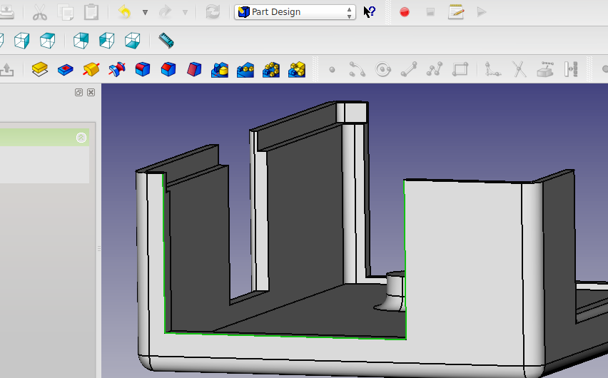

#Raspberry Pi Case scripted with Python in FreeCAD

This is Open Source code for a 3D Printable case for the Raspberry Pi model B microcomputer board. For various levels of customization you can start with:

- The Python script, which can be pasted into FreeCAD and modified to suit.
- The finished FreeCAD files
- The final .stl files (if you just want to print it as-is)

The lid of the case is customizable using an SVG file which is embossed or cut from the lid. Download the free Inkscape software to create your own.

###Get tools at:

[http://www.inkscape.org/en/](http://www.inkscape.org/en/)

[http://freecadweb.org/](http://freecadweb.org/)
